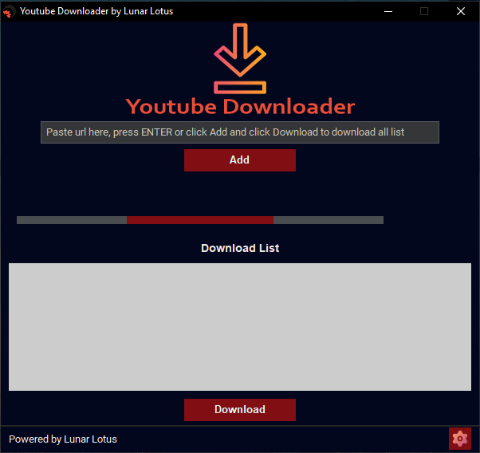
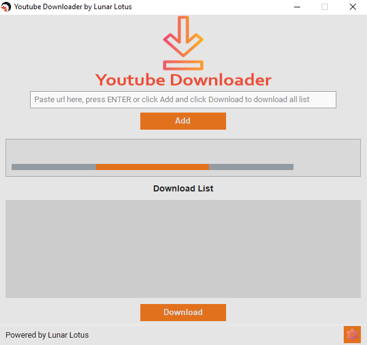
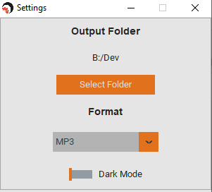

  <picture>
    <source media="(prefers-color-scheme: dark)" srcset="./static/img/lunar_lotus_logo.ico">
    
  </picture>
  
  <picture>
    <source media="(prefers-color-scheme: dark)" srcset="./static/img/logo_ydl.png">
    
  </picture>

  <h3> Yet another Youtube Downloader, build with Tkinter</h3>

---

This is a simple Youtube Downloader GUI application build in python with tkinter and TomSchimansky [customtkinter](https://github.com/TomSchimansky/CustomTkinter). I built it because I didn't found what I wanted, so made it as simple possible. 

  

    <picture>
      <source media="(prefers-color-scheme: dark)" srcset="./static/doc_images/yt_dl_dark.PNG">
      
    </picture>
    <picture>
      <source media="(prefers-color-scheme: dark)" srcset="./static/doc_images/yt_dl_light.PNG">
      
    </picture>
  

  
  

    <picture>
      <source media="(prefers-color-scheme: dark)" srcset="./static/doc_images/yt_dl_st.PNG">
      
    </picture>
  

### Where to get the .exe file ? 
- You can get the exe file [here](https://github.com/LenRenko/lotus-ydl/releases) or click on release on the right
- Extract the archive (with [winrar](https://www.win-rar.com/start.html?L=10) or [7zip](https://www.7-zip.org/download.html)) where you want on your computer
- Go to the folder LLYTDownloader and look for the **LLYTDownloader.exe**

### How to use with Python ?
- Clone the repo to your computer or download [source code](https://github.com/LenRenko/lotus-ydl/archive/refs/tags/V1.0.0.zip) and extract it where you want
- Install requirements with `pip install -r requirements.txt`
- Launch `python main.py`

### How to use it ?
- Go to youtube and copy the url of your favorite song or video
- Launch with LLYTDownloader.exe
- Follow the instructions on your screen :-> Paste your url on the entry, press ENTER or click add to add your url to download list
- Do step 1 to 3 again if you want. 
- When you have all your desired urls to download :-> Click DOWNLOAD button and wait for it to download. 

###### Open settings
- To open settings window, click on the gear button on the bottom right and chose desired options
